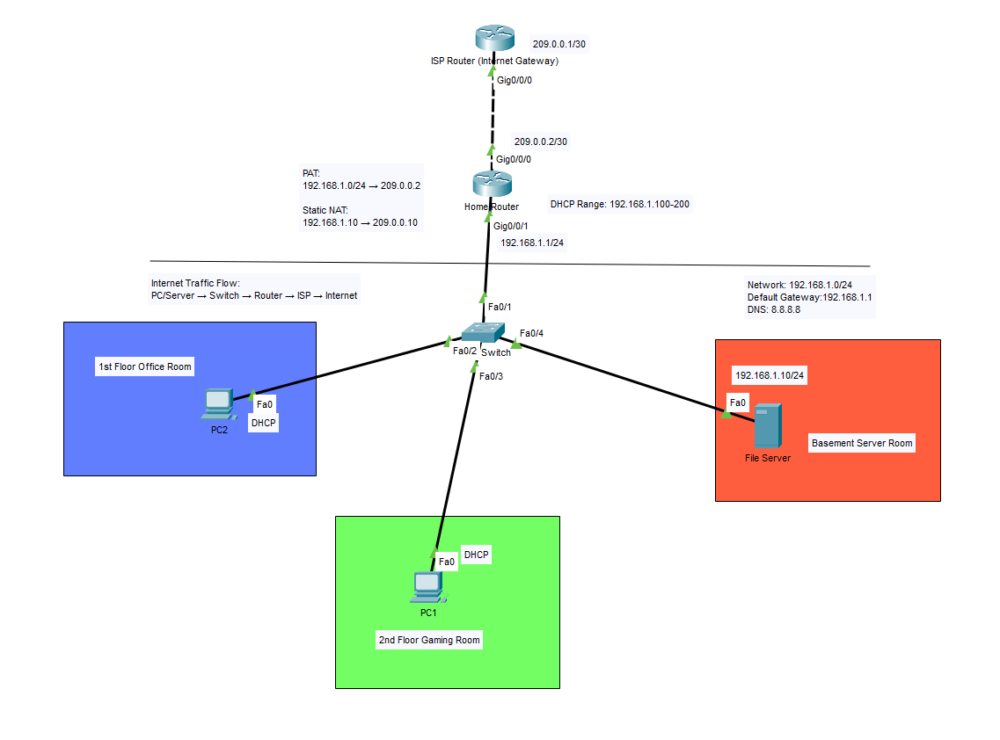

# Home Network Documentation

### Author: Gen Li
### Organization: MITT
### Project: Lesson 5: Create Your Network Docs
### Instructor: Jibing Liang

## Document Information

| Version | Date       | Description                | Author |
|--------|------------|----------------------------|--------|
| 1.0    | 2026-03-31 | Initial Network Documentation | Gen Li |

## 1. Overview
This document describes the design and implementation of a home network built using Cisco Packet Tracer. The network simulates a real-world residential setup, including internet connectivity, internal device communication, and basic security and NAT configurations.

  

<em>Figure: Topology of Home Network</em>

## 2. Physical Topology

The physical network consists of the following components:

- ISP Router (Internet Gateway)
- Home Router
- Layer 2 Switch (LAN Distribution)
- Devices:
  - PC1 (2nd Floor Gaming Room)
  - PC2 (1st Floor Office Room)
  - File Server (Basement Server Room)

### Physical Connections:

- ISP Router (G0/0/0) → Home Router (G0/0/0)
- Home Router (G0/0/1) → Switch (Fa0/1)
- Switch connections:
  - Fa0/2 → PC2
  - Fa0/3 → PC1
  - Fa0/4 → File Server

All wired connections use Ethernet cables.

## 3. Logical Topology

### WAN Network:
- Network: 209.0.0.0/30
- ISP Router: 209.0.0.1
- Home Router (WAN): 209.0.0.2

### LAN Network:
- Network: 192.168.1.0/24
- Default Gateway: 192.168.1.1
- DNS Server: 8.8.8.8

### Traffic Flow:
Internet traffic flows as follows:

PC/Server → Switch → Home Router → ISP Router → Internet

All outbound traffic is routed through the Home Router using NAT.

### Routing:
- Default Route: 0.0.0.0/0 → 209.0.0.1

## 4. IP Addressing Scheme

| Device        | Interface | IP Address      | Method  |
|--------------|----------|-----------------|---------|
| ISP Router    | G0/0/0   | 209.0.0.1       | Static  |
| Home Router   | G0/0/0   | 209.0.0.2       | Static  |
| Home Router   | G0/0/1   | 192.168.1.1     | Static  |
| File Server   | Fa0      | 192.168.1.10    | Static  |
| PC1           | Fa0      | DHCP            | Dynamic |
| PC2           | Fa0      | DHCP            | Dynamic |

## 5. Network Services

### Home Router:
- DHCP Server
- NAT (PAT + Static NAT)
- Default Gateway
- Internet routing

### File Server:
- Internal file storage
- SMB-based file sharing service

## 6. Device Configurations

### DHCP Configuration:
- Pool Range: 192.168.1.100 – 192.168.1.200
- Subnet Mask: 255.255.255.0
- Default Gateway: 192.168.1.1
- DNS Server: 8.8.8.8

### NAT Configuration:

#### PAT (Port Address Translation):
- Internal Network: 192.168.1.0/24
- Translated to: 209.0.0.2

#### Static NAT:
- 192.168.1.10 → 209.0.0.10

## 7. Security Considerations

Basic network security is implemented through:

- NAT to hide internal IP addresses
- Controlled access to internal server
- Separation between internal LAN and external network

No direct inbound access is allowed except through static NAT mapping.

## 8. Credential Security

Credentials are stored securely using:

- Password manager (e.g., Bitwarden)
- Strong passwords (minimum 12 characters)
- No credentials stored in plain text

## 9. Future Improvements

- VLAN segmentation (e.g., Guest vs Private network)
- Advanced firewall rules
- Network monitoring tools (e.g., Wireshark)
- Wireless network expansion

---
